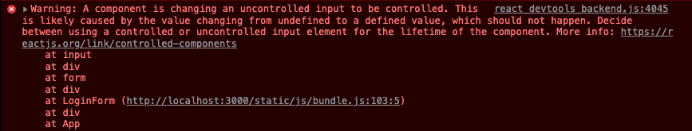

# Form Handling in React

### Create form

For styling purpose, we are using bootstrap. Install bootstrap and import it to index.js file

```js
npm i bootstrap

//index.js
import React from 'react';
import ReactDOM from 'react-dom';
import App from './App';
import './index.css';
import 'bootstrap/dist/css/bootstrap.css';

ReactDOM.render(
  <React.StrictMode>
    <App />
  </React.StrictMode>,
  document.getElementById('root')
);

```

create a login form in LoginForm.jsx and import it into App.js

```js
// LoginForm.jsx
import React, { Component } from 'react';

export class LoginForm extends Component {
  render() {
    return (
      <div>
        <h3 className='display-3 text-center mt-5 mb-5'>Login</h3>
        <form>
          <div className='mb-3'>
            <label htmlFor='username' className='form-label'>
              Username
            </label>
            <input id='username' type='text' className='form-control' />
          </div>
          <div className='mb-3'>
            <label htmlFor='password' className='form-label'>
              Password
            </label>
            <input id='password' type='text' className='form-control' />
          </div>
          <button type='submit' className='btn btn-primary'>
            Submit
          </button>
        </form>
      </div>
    );
  }
}

export default LoginForm;

// App.js
import './App.css';
import { LoginForm } from './components/LoginForm';

function App() {
  return (
    <div className='container'>
      <LoginForm />
    </div>
  );
}

export default App;

```

### Prevent default behaviour of form submission

When we submit a form, it makes full round trip to server. It means, form send data to server as request and returns back to client and renders the page with response.

In react, we need to take control from form submission to send proper data to server at proper time.

```js
 handleFormSubmit = (event) => {
    event.preventDefault();

    // Validate data and sends data to server
    console.log('Form Submitted');
};

<form onSubmit={this.handleFormSubmit}>
```

### How to use refs

Refs are used to access the DOM elements instead of using the document methods in javascript.
React opposes selecting DOM elements and modifying it. It downs the perfomance. But in certain situations, we need to work with DOM. Only at that time use refs.

```js
usernameRef = React.createRef();

componentDidMount = () => {
  this.usernameRef.current.focus();
};

<input
  ref={this.usernameRef}
  id='username'
  type='text'
  className='form-control'
/>;
```

### Controlled Elements or Controlled Components

This is heart of hadling form in React apps. When we type something in form field, data will be stored in Browser DOM. In React, instead of saving the data in browser DOM, we store the data in state and send the data to form field as value.

```js
state = {
  account: {
    username: '',
    password: '',
  },
};

handleChange = ({ target: input }) => {
  const account = { ...this.state.account };
  account[input.name] = input.value;
  this.setState({ account });
};

<form onSubmit={this.handleFormSubmit}>
  <div className='mb-3'>
    <label htmlFor='username' className='form-label'>
      Username
    </label>
    <input
      id='username'
      name='username'
      type='text'
      value={account.username}
      onChange={this.handleChange}
      ref={this.usernameRef}
      className='form-control'
    />
  </div>
  <div className='mb-3'>
    <label htmlFor='password' className='form-label'>
      Password
    </label>
    <input
      id='password'
      name='password'
      type='text'
      value={account.password}
      onChange={this.handleChange}
      className='form-control'
    />
  </div>
  <button type='submit' className='btn btn-primary'>
    Submit
  </button>
</form>;
```

**Common Error:** If we give _undefined or null_ value to input field. Inputs considers as uncontrolled element. When we handle input change and modifies input value, React gives warning that don't change input from uncontrolled to control element, fix either one.



**tip:** Defined properties should not use for custom components

```js
// ex: ref
<Input
  name='username'
  label='Username'
  type='text'
  value={account.username}
  onChange={this.handleChange}
  ref={this.usernameRef}
/>
instead use
<Input
  name='username'
  label='Username'
  type='text'
  value={account.username}
  onChange={this.handleChange}
  ref={this.usernameRef}
/>
```

### Validation on Form Submit and Field Change

```js
import React, { Component } from 'react';
import Input from './common/Input';

export class LoginForm extends Component {
  state = {
    account: {
      username: '',
      password: '',
    },
    errors: {},
  };

  usernameRef = React.createRef();

  componentDidMount = () => {
    this.usernameRef.current.focus();
  };

  handleFormSubmit = (event) => {
    event.preventDefault();

    const errors = this.validateForm();
    if (errors) {
      this.setState({ errors });
      return;
    } else this.setState({ errors: {} });

    // Validate data and sends data to server
    console.log('Form Submitted', this.state.account);
  };

  validateForm = () => {
    const errors = {};
    const { account } = this.state;
    if (account.username.trim() === '') {
      errors.username = 'Username is required';
    }
    if (account.password.trim() === '') {
      errors.password = 'Passsword is required';
    }
    return Object.keys(errors).length ? errors : null;
  };

  handleChange = ({ target: input }) => {
    const errors = { ...this.state.errors };
    const errorMessage = this.validateField(input);
    errors[input.name] = errorMessage;
    this.setState({ errors });
    !errorMessage && delete errors[input.name];

    const account = { ...this.state.account };
    account[input.name] = input.value;
    this.setState({ account });
  };

  validateField = ({ name, value }) => {
    if (name === 'username') {
      if (value.trim() === '') {
        return 'Username is required';
      }
    }
    if (name === 'password') {
      if (value.trim() === '') {
        return 'Passsword is required';
      }
    }
    return null;
  };

  render() {
    const { account, errors } = this.state;
    return (
      <div>
        <h3 className='display-3 text-center mt-5 mb-5'>Login</h3>
        <form onSubmit={this.handleFormSubmit}>
          <Input
            name='username'
            label='Username'
            type='text'
            value={account.username}
            onChange={this.handleChange}
            error={errors.username}
            inputRef={this.usernameRef}
          />
          <Input
            name='password'
            label='Password'
            type='text'
            value={account.password}
            onChange={this.handleChange}
            error={errors.password}
          />
          <button type='submit' className='btn btn-primary'>
            Submit
          </button>
        </form>
      </div>
    );
  }
}

export default LoginForm;
```

### Validate on Form Submission and Field Change using Joi

```js
import React, { Component } from 'react';
import Input from './common/Input';
import Joi from 'joi';

export class LoginForm extends Component {
  state = {
    account: {
      username: '',
      password: '',
    },
    errors: {},
    schema: {
      username: Joi.string().min(3).max(30).required().label('Username'),
      password: Joi.string().min(3).max(30).required().label('Password'),
    },
  };

  accountSchema = Joi.object({
    username: this.state.schema.username,
    password: this.state.schema.password,
  });

  usernameRef = React.createRef();

  componentDidMount = () => {
    this.usernameRef.current.focus();
  };

  handleFormSubmit = (event) => {
    event.preventDefault();

    const errors = this.validateForm();
    if (errors) {
      this.setState({ errors });
      return;
    } else this.setState({ errors: {} });

    // Validate data and sends data to server
    console.log('Form Submitted', this.state.account);
  };

  validateForm = () => {
    const errors = {};
    const { account } = this.state;
    // if (account.username.trim() === '') {
    //   errors.username = 'Username is required';
    // }
    // if (account.password.trim() === '') {
    //   errors.password = 'Passsword is required';
    // }
    const { error } = this.accountSchema.validate(account, {
      abortEarly: false,
    });
    error &&
      error.details.map((err) => {
        errors[err.path[0]] = err.message;
      });
    return Object.keys(errors).length ? errors : null;
  };

  handleChange = ({ target: input }) => {
    const errors = { ...this.state.errors };
    const errorMessage = this.validateField(input);
    errors[input.name] = errorMessage;
    this.setState({ errors });
    !errorMessage && delete errors[input.name];

    const account = { ...this.state.account };
    account[input.name] = input.value;
    this.setState({ account });
  };

  validateField = ({ name, value }) => {
    // if (name === 'username') {
    //   if (value.trim() === '') {
    //     return 'Username is required';
    //   }
    // }
    // if (name === 'password') {
    //   if (value.trim() === '') {
    //     return 'Passsword is required';
    //   }
    // }
    const fieldSchema = this.state.schema[name];
    const { error } = fieldSchema.validate(value);
    return error ? error.message : null;
  };

  render() {
    const { account, errors } = this.state;
    return (
      <div>
        <h3 className='display-3 text-center mt-5 mb-5'>Login</h3>
        <form onSubmit={this.handleFormSubmit}>
          <Input
            name='username'
            label='Username'
            type='text'
            value={account.username}
            onChange={this.handleChange}
            error={errors.username}
            inputRef={this.usernameRef}
          />
          <Input
            name='password'
            label='Password'
            type='text'
            value={account.password}
            onChange={this.handleChange}
            error={errors.password}
          />
          <button type='submit' className='btn btn-primary'>
            Submit
          </button>
        </form>
      </div>
    );
  }
}

export default LoginForm;
```

### Disabling the submit button

```js
<button
  disabled={this.validateForm() ? true : false}
  type='submit'
  className='btn btn-primary'
>
  Submit
</button>
```

### Extracting Form

```js

// Form.jsx
import React, { Component } from 'react';
import Input from './Input';

export class Form extends Component {
  handleFormSubmit = (event) => {
    event.preventDefault();

    const errors = this.validateForm();
    if (errors) {
      this.setState({ errors });
      return;
    } else this.setState({ errors: {} });

    this.handleDataSubmit();
  };

  validateForm = () => {
    const errors = {};
    const { data } = this.state;
    // if (data.username.trim() === '') {
    //   errors.username = 'Username is required';
    // }
    // if (data.password.trim() === '') {
    //   errors.password = 'Passsword is required';
    // }
    const { error } = this.dataSchema.validate(data, {
      abortEarly: false,
    });
    error &&
      error.details.map((err) => {
        errors[err.path[0]] = err.message;
      });
    return Object.keys(errors).length ? errors : null;
  };

  handleChange = ({ target: input }) => {
    const errors = { ...this.state.errors };
    const errorMessage = this.validateField(input);
    errors[input.name] = errorMessage;
    this.setState({ errors });
    !errorMessage && delete errors[input.name];

    const data = { ...this.state.data };
    data[input.name] = input.value;
    this.setState({ data });
  };

  validateField = ({ name, value }) => {
    // if (name === 'username') {
    //   if (value.trim() === '') {
    //     return 'Username is required';
    //   }
    // }
    // if (name === 'password') {
    //   if (value.trim() === '') {
    //     return 'Passsword is required';
    //   }
    // }
    const fieldSchema = this.state.schema[name];
    const { error } = fieldSchema.validate(value);
    return error ? error.message : null;
  };

  renderButton = (label) => {
    return (
      <button
        disabled={this.validateForm() ? true : false}
        type='submit'
        className='btn btn-primary'
      >
        {label}
      </button>
    );
  };

  renderInput = (name, label, type = 'text', inputRef) => {
    const { data, errors } = this.state;
    return (
      <Input
        name={name}
        label={label}
        type={type}
        value={data[name]}
        onChange={this.handleChange}
        error={errors[name]}
        inputRef={inputRef}
      />
    );
  };
}

export default Form;

// LoginForm.jsx
import React from 'react';
import Joi from 'joi';
import Form from './common/Form';

export class LoginForm extends Form {
  state = {
    data: {
      username: '',
      password: '',
    },
    errors: {},
    schema: {
      username: Joi.string().min(3).max(30).required().label('Username'),
      password: Joi.string().min(3).max(30).required().label('Password'),
    },
  };

  dataSchema = Joi.object({
    username: this.state.schema.username,
    password: this.state.schema.password,
  });

  usernameRef = React.createRef();

  componentDidMount = () => {
    this.usernameRef.current.focus();
  };

  handleDataSubmit = () => {
    // Validate data and sends data to server
    console.log('Form Submitted', this.state.data);
  };

  render() {
    return (
      <div>
        <h3 className='display-3 text-center mt-5 mb-5'>Login</h3>
        <form onSubmit={this.handleFormSubmit}>
          {this.renderInput('username', 'Username', 'text', this.usernameRef)}
          {this.renderInput('password', 'Password', 'password')}
          {this.renderButton('Login')}
        </form>
      </div>
    );
  }
}

export default LoginForm;

```

### Rest and Spread pattern

```js
import React from 'react';

function Input({ name, label, inputRef, error, ...rest }) {
  return (
    <div className='mb-3'>
      <label htmlFor={name} className='form-label'>
        {label}
      </label>
      <input
        {...rest}
        name={name}
        id={name}
        ref={inputRef}
        className={error ? 'form-control is-invalid' : 'form-control'}
        aria-describedby='validation-error'
      />
      {error && (
        <div id='validation-error' className='invalid-feedback'>
          {error}
        </div>
      )}
    </div>
  );
}

export default Input;
```
